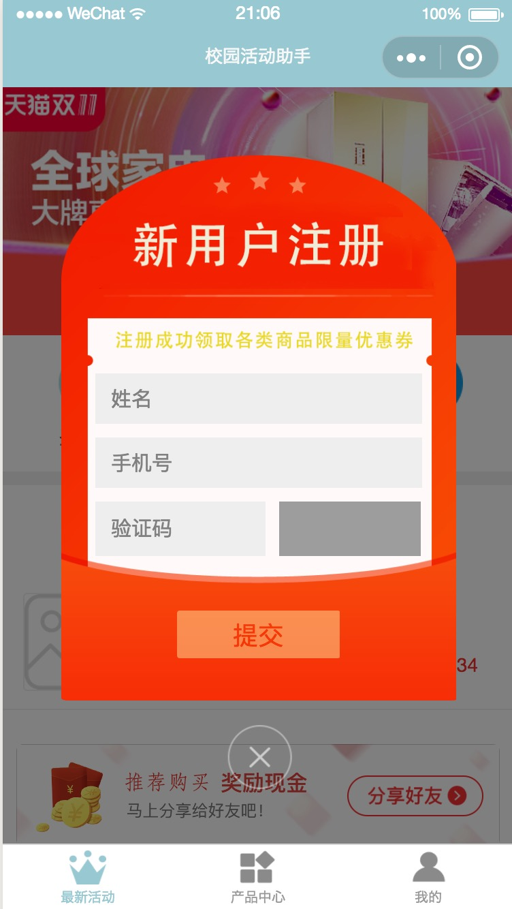
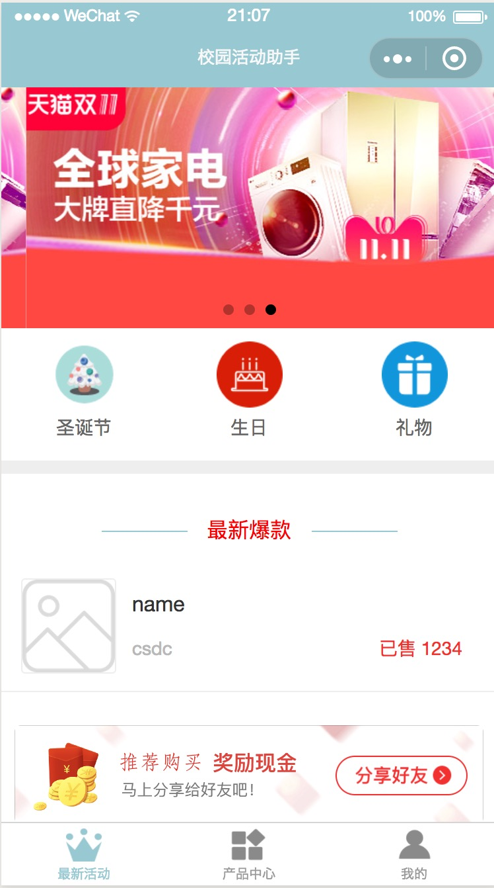
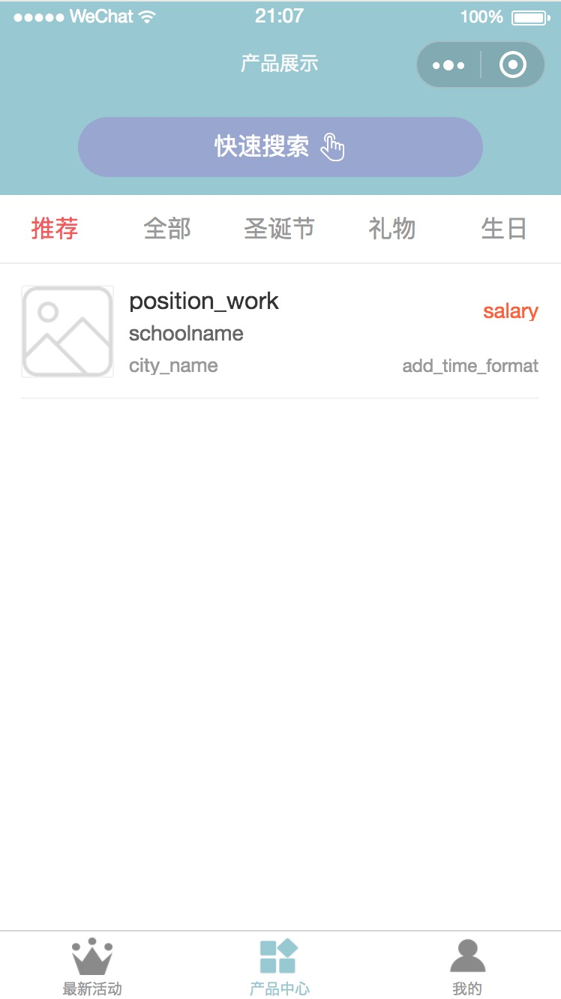
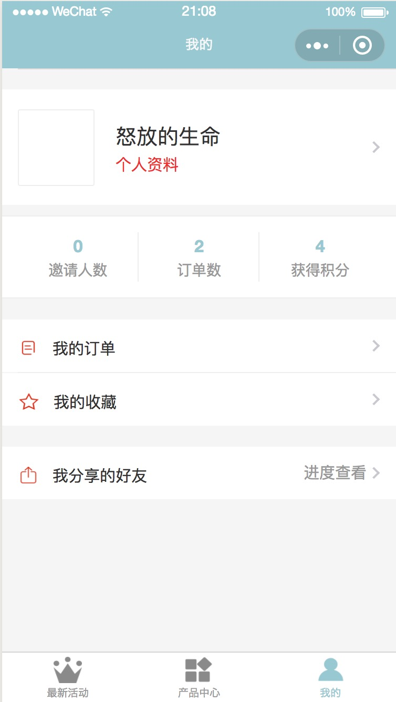

# wechat-app-mobile
wechat applet mobile web application

## preface 
This is a wechat online platform for campus students to exchange or buy product in special day or some diffent activities. Currently, we want to camplish Chrisma Day sell Eve's apples and provide some other festivals presents for students in University.

## functional schedule
Christmas Day：
 - Sell apples: share, draw a lottery, and group to shopping...
Shop coupons：
 - Shop coupons: use coupons for self, give to others, and verify thecoupon
Secondhand book transaction：
 - sec-hand book platform: users can publish and others can review books messages.

 ## Functional screenshot
 - 注册
 
 - 首页
 
 - 列表
 
 - 我的
 